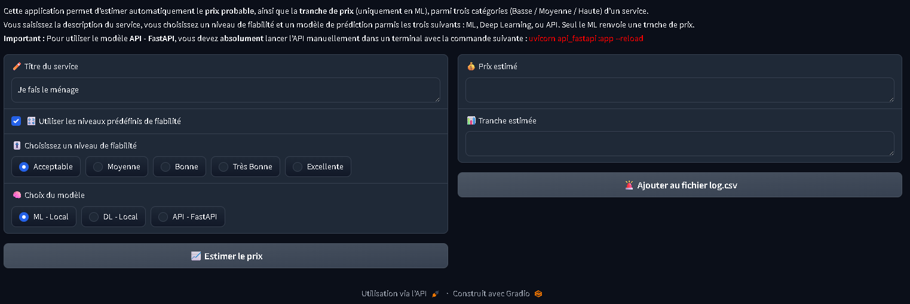

# 🔮 Prédiction de prix sur Fiverr — Projet IA

Ce projet explore l’usage de l’intelligence artificielle pour **prédire le prix d’une prestation freelance sur la plateforme Fiverr**, en se basant sur :

- la **description textuelle** du service,
- le **niveau du vendeur** (Nouveau, Confirmé, Top),
- la **fiabilité estimée** du profil (note composite calculée à partir des évaluations).

Il s’appuie sur un pipeline **modulaire et reproductible**, combinant des techniques de **traitement de texte**, de **vectorisation par embeddings**, de **régression supervisée**, de **classification**, et une **application Gradio**.

---

## 🎯 Objectifs

1. **Prédire le prix exact** d’un service à partir de sa description et des attributs du vendeur.  
2. **Classifier le service dans une tranche de prix** : `Basse`, `Moyenne` ou `Haute`.  
3. **Proposer une interface interactive** pour tester les modèles sur des cas réels.

<p align="center">
  
</p>
---

## 📦 Fonctionnalités clés

- ✅ Nettoyage complet des données brutes issues de Fiverr.
- 🧠 Embeddings sémantiques via `sentence-transformers` pour les descriptions.
- 📈 Modélisation :
  - Régression : `GradientBoostingRegressor`
  - Classification : `DecisionTreeClassifier`
- 🔍 Évaluation comparative des modèles : `MAE`, `RMSE`, `Accuracy`, `F1-score`.
- 💾 Sauvegarde automatique des modèles, colonnes, transformateurs et prédictions.
- 🌐 Application interactive avec `Gradio`.

---

## ⚙️ Choix techniques

| Composant            | Choix retenu                                   | Raison                                                                 |
|----------------------|------------------------------------------------|------------------------------------------------------------------------|
| Texte libre          | Embeddings BERT (`all-MiniLM-L6-v2`)           | Représentation sémantique avancée et compacte                          |
| Variables numériques | StandardScaler                                 | Meilleure convergence et robustesse des modèles                        |
| Algorithmes ML       | Gradient Boosting, Decision Tree               | Performants, interprétables, adaptés aux petits jeux tabulaires        |
| Interface            | Gradio                                         | Déploiement simple, ergonomie efficace pour la démonstration           |
| Organisation         | Notebooks modulaires                           | Exécution claire, maintenance facilitée, lisibilité pédagogique        |

---

## 🗂️ Structure du projet

| Dossier                              | Contenu du dossier                                                        |
|--------------------------------------|---------------------------------------------------------------------------|
| ia.follaco.fr/                       | Dossier racine du projet                                                  |
| ia.follaco.fr/data/                  | Stockage des fichiers *.csv de données brutes et nettoyées                |
| ia.follaco.fr/data/prediction_grid/  | Stockage des fichiers *.csv de résultats de priction par paires de modèle |
| ia.follaco.fr/flagged/               | Stockage du fichiers log.csv , il enregistre les résultats pour analyse   |
| ia.follaco.fr/img/                   | Stockage des images nécessaires à certaines explications                  |
| ia.follaco.fr/models/                | Stockage des modèles de regression et de classification entrainés         |
| ia.follaco.fr/models/regression/     | Stockage des modèles de regression entrainés                              |
| ia.follaco.fr/models/classification/ | Stockage des modèles de classification entrainés                          |

---

## 🚀 Fonctionnement

1. **Prétraitement des données** (`01_pre-processing.ipynb`)  
   Nettoyage du jeu de données brut : suppression des doublons, traitement des prix aberrants, uniformisation des formats, et export d’un fichier transformé prêt à l’usage.

2. **Modélisation - Régression** (`02_model_regression.ipynb`)  
   Construction des features à partir des variables classiques, entraînement et évaluation de modèles de régression (RandomForest, XGBoost, etc.) pour prédire le **prix exact**.

3. **Modélisation - Classification** (`03_model_classification.ipynb`)  
   Création de la variable cible `Tranche` (prix bas / moyen / élevé), puis entraînement de modèles de classification pour estimer **la gamme de prix**.

4. **Modélisation - Deep Learning** (`04_model_deep_learning.ipynb`)  
   Entraînement d’un modèle **deep learning** utilisant des **embeddings textuels** (via `SentenceTransformer`) combinés à des variables numériques, afin de prédire le prix. Ce modèle est exporté au format `.h5`.

5. **Prédiction scriptée** (`05_predict.py`)  
   Regroupe les fonctions de prédiction prêtes à l’emploi : chargement des modèles, transformation des nouvelles entrées, et génération des prédictions (prix et tranche).

6. **API REST avec FastAPI** (`06_api_fastapi.py`)  
   Implémente une API REST permettant de soumettre une requête (description, niveau, fiabilité) et de recevoir une prédiction de prix via une architecture déployable localement avec `uvicorn`.

7. **Interface utilisateur interactive** (`07_app.ipynb`)  
   Application **Gradio** pour tester dynamiquement les différents modèles (ML, Deep Learning, API REST). L’utilisateur peut saisir une description, choisir un niveau de fiabilité, visualiser les résultats, et **enregistrer** les prédictions dans un fichier `log.csv`.


---

## 📊 Exemples de résultats

### 🔢 Régression — Comparatif des modèles

| Modèle                | MAE   | RMSE  | R²      |
|------------------------|-------|--------|----------|
| **Gradient Boosting**  | 3.21  | 4.90   | **0.2566** |
| XGBoost                | 3.33  | 5.00   | 0.2274   |
| Random Forest          | 3.32  | 5.03   | 0.2173   |
| Ridge                  | 3.82  | 5.47   | 0.0748   |
| KNN Regressor          | 3.99  | 5.80   | -0.0407  |
| Decision Tree          | 4.43  | 7.14   | -0.5770  |
| Linear Regression      | 5.86  | 9.90   | -2.0353  |

✅ **Modèle retenu** : Gradient Boosting Regressor — *meilleur compromis entre précision et stabilité (RMSE = 4.90)*.

---

### 🏷️ Classification — Comparatif des modèles

| Modèle               | Accuracy |
|----------------------|----------|
| **Decision Tree**    | **0.6175** |
| Random Forest        | 0.5339   |
| KNN Classifier       | 0.5179   |
| Logistic Regression  | 0.5100   |

✅ **Modèle retenu** : Decision Tree Classifier — *meilleur score d’accuracy (61.75 %) sur les tranches Basse / Moyenne / Haute.*

---

## ✅ Compétences mobilisées

Ce projet couvre des **compétences issues des blocs 3 et 5** de la certification IA :

| Bloc   | Compétence | Description                                                                                          | Notebooks concernés                                                                 |
|--------|------------|------------------------------------------------------------------------------------------------------|--------------------------------------------------------------------------------------|
| Bloc_3 | C1         | Sélection du meilleur algorithme ML selon les performances (MAE, RMSE, Accuracy…)                   | `02_model_regression.ipynb`, `03_model_classification.ipynb`                         |
| Bloc_3 | C2         | Prétraitement des données (scaling, encodage, embeddings) adapté à chaque type de modèle            | `01_pre-processing.ipynb`, `02_model_regression.ipynb`, `03_model_classification.ipynb`, `04_model_deep_learning.ipynb`, `05_predict.ipynb` |
| Bloc_3 | C3         | Entraînement et validation de modèles ML supervisés sur métriques définies                          | `02_model_regression.ipynb`, `03_model_classification.ipynb`                         |
| Bloc_5 | C1         | Transformation de textes en vecteurs numériques (embeddings BERT via `sentence-transformers`)       | `01_pre-processing.ipynb`, `02_model_regression.ipynb`, `04_model_deep_learning.ipynb`, `05_predict.ipynb` |
| Bloc_5 | C2         | Comparaison de modèles hybrides (ML vs Deep Learning) adaptés aux contraintes du cas métier         | `02_model_regression.ipynb`, `04_model_deep_learning.ipynb`, `05_predict.ipynb`      |
| Bloc_5 | C3         | Entraînement de modèles Deep Learning exploitant les embeddings textuels                            | `04_model_deep_learning.ipynb`                                                      |
| Bloc_5 | C4         | Déploiement du pipeline avec une interface Gradio et exposition d’un modèle via une API FastAPI     | `06_app.ipynb`, `06_api_fastapi.ipynb`                                              |

---

## 🔧 Installation rapide

⚠️ **IMPORTANT**
- L'ensemble du programme fonctionne avec :
    - la version 3.10.11 de python.
    - La liste des packages listé dans "requirements.txt".

```bash
git clone https://github.com/lululafrite/ia.follaco.fr.git
cd ia.follaco.fr
.venv\Scripts\activate
pip install -r requirements.txt
```

## 👨‍🏫 Remarques pédagogiques

- Chaque notebook est autonome, avec une structure claire et des explications guidées.
- Le projet est conçu pour favoriser la modularité et la réutilisabilité en production.
- L’interface utilisateur permet de tester directement la chaîne prédictive.
- Le notebook "04_predict.ipynb" n'est pas utilisé par l'application, il est à usage pédagogique.
- Le fichier "predict.py" est importé par le notebook "05_app.ipynb" car il contient les fonctione de prédiction.

## 👤 Contact

Ludovic FOLLACO  
ludovic.follaco@gmail.com  
https://www.follaco.fr  
https://www.linkedin.com/in/ludovic-follaco-a74b5394/